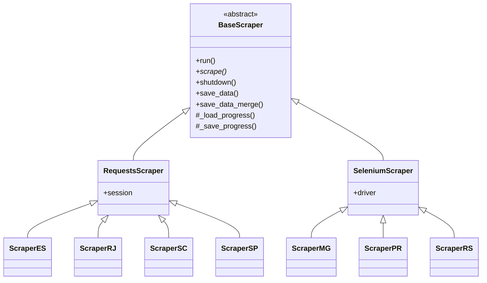
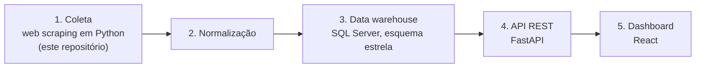

# TCC — Coleta de remunerações dos Tribunais de Contas Estaduais

> **English:** Data-collection stage of my undergraduate thesis (Information Systems, UFSC): Python web scrapers that extract public payroll data from 7 Brazilian State Courts of Accounts (ES, MG, PR, RJ, RS, SC, SP) into monthly raw JSON files.

Este repositório contém a **etapa de coleta** do meu Trabalho de Conclusão de Curso em Sistemas de Informação na UFSC (previsão de conclusão: dezembro de 2026). São web scrapers em Python que extraem, dos portais de transparência, os dados de remuneração dos servidores de sete Tribunais de Contas Estaduais (TCEs) e os gravam como arquivos JSON mensais, um por tribunal e competência.

As demais etapas do pipeline (normalização, data warehouse, API e dashboard) não estão na branch `main` deste repositório. Veja [Pipeline completo](#pipeline-completo).

## Tribunais cobertos

| Tribunal | Coletor | Acesso ao portal | Competências em `Dados_<UF>/` | Arquivos |
|---|---|---|---|---|
| TCE-ES | `webscraper_es.py` | `requests` + BeautifulSoup | 01/2020 – 03/2026 | 75 |
| TCE-MG | `webscraper_mg.py` | Selenium (navegador visível, reCAPTCHA manual) | 01/2020 – 09/2025 | 69 |
| TCE-PR | `webscraper_pr.py` | Selenium + BeautifulSoup | 01/2020 – 03/2026 ¹ | 62 |
| TCE-RJ | `webscraper_rj.py` | `requests` + BeautifulSoup | 01/2020 – 12/2023 | 48 |
| TCE-RS | `webscraper_rs.py` | Selenium | 01/2020 – 02/2026 | 74 |
| TCE-SC | `webscraper_sc.py` | `requests` + BeautifulSoup | 01/2020 – 03/2026 | 75 |
| TCE-SP | `webscraper_sp.py` | `requests` + BeautifulSoup | 01/2021 – 02/2026 | 62 |

¹ O PR não tem arquivo para 13 competências: 03, 05, 08 e 10/2020; 02, 06, 08 e 09/2021; 01/2022; 04, 06, 08 e 11/2023.

## Estrutura do repositório

```text
.
├── Scrapers/
│   ├── base_scraper.py      # classes base compartilhadas pelos coletores
│   ├── webscraper_<uf>.py   # um coletor por tribunal (es, mg, pr, rj, rs, sc, sp)
│   ├── debug_rj.py          # script de diagnóstico do portal do TCE-RJ
│   └── Dados_<UF>/          # JSON coletados + progress.json (checkpoint)
├── TCE_html/                # cópias salvas do HTML dos portais de ES, PR, RJ, RS, SC e SP
├── .github/workflows/
│   └── scrapers.yml         # coleta de RJ e RS no GitHub Actions
├── Dashboards.py            # painel Streamlit legado (veja o fim deste README)
└── requirements.txt
```

## Como os scrapers funcionam

### Classes base

Todos os coletores herdam de [`Scrapers/base_scraper.py`](Scrapers/base_scraper.py):



- **`BaseScraper`** (classe abstrata): `run()` define o fluxo comum a todos os tribunais (padrão *Template Method*). Ele registra o início, chama `scrape()` (implementado por cada coletor), captura e registra qualquer erro não tratado, informa a duração no log e sempre chama `shutdown()` para liberar recursos. A classe também concentra o log com timestamp, a gravação de JSON (`save_data`), a gravação incremental com deduplicação (`save_data_merge`) e o checkpoint em `progress.json`.
- **`RequestsScraper`**: cria uma `requests.Session` com `User-Agent` de navegador e retry automático do `urllib3` nos adaptadores HTTP e HTTPS, com `Retry(total=5, backoff_factor=10, status_forcelist=[429, 500, 502, 503, 504])`, ou seja, até 5 novas tentativas com backoff exponencial.
- **`SeleniumScraper`**: inicia o Chrome (headless por padrão, com `--no-sandbox` e `--disable-dev-shm-usage`) e aponta a pasta de downloads para a pasta de saída do tribunal, que é por onde o coletor de MG recebe os arquivos exportados pelo portal. `shutdown()` fecha o navegador.

### Requests ou Selenium

Os portais que respondem a requisições HTTP diretas (ES, RJ, SC e SP) usam `RequestsScraper`, com o HTML interpretado por BeautifulSoup. Os de MG, PR e RS, cujos formulários são montados por JavaScript/AJAX (o de MG usa PrimeFaces e o do RS, Oracle APEX), usam `SeleniumScraper`.

- **TCE-ES**: um POST lista os servidores por situação (ativo e inativo). A página de cada servidor traz o histórico de créditos e descontos em JSON, dentro de campos `input` ocultos, e o coletor agrupa esses lançamentos por competência a partir de 2020.
- **TCE-MG**: roda com o navegador visível e **exige que uma pessoa resolva o reCAPTCHA** (o coletor espera até 5 minutos). Na fase 1, enfileira no portal uma exportação JSON por competência, de 09/2025 retroativamente até 01/2020. Na fase 2, baixa os arquivos pelo modal "Gerenciar downloads" e os renomeia para `tce_mg_MM_AAAA.json`. O conteúdo é o JSON exportado pelo próprio portal.
- **TCE-PR**: para cada competência a partir de 2020 e cada natureza disponível no formulário (por exemplo, "Efetivos"), pagina os resultados e extrai os valores com BeautifulSoup.
- **TCE-RJ**: o portal mantém a sessão em um token na URL. O coletor abre a sessão em três passos (página inicial, "Filtrar" e listagem sem paginação), lista todos os servidores e, para cada matrícula, consulta as competências disponíveis e faz um POST por competência.
- **TCE-RS**: percorre as situações (ativos, inativos e exonerados) página a página, abre cada servidor em outra aba e lê cada competência do seletor de período. É o único coletor que lê a variável de ambiente `TARGET_YEAR` para coletar apenas um ano.
- **TCE-SC**: um POST por competência e categoria (ativo, inativo, pensionista e estagiário) retorna a lista de servidores, e o contracheque de cada um vem de um endpoint que responde em JSON. O coletor espera 0,25 s entre uma consulta de contracheque e outra.
- **TCE-SP**: faz GET paginado por ano, mês, situação (ativo e inativo) e identificação (servidor, membro e residente-bolsista). O portal identifica os anos por IDs internos, mapeados em `mapa_anos` apenas para 2021–2026; por isso a série de SP começa em 2021.

### Retentativas

Além do retry da sessão HTTP, alguns coletores têm retentativas próprias. Elas cobrem casos que o `Retry` do `urllib3` não trata: por padrão, ele não repete requisições POST por status HTTP e não tem como renovar a sessão de um portal.

- **SC**: na consulta do contracheque, em 403, 429, 500, 502, 503 ou 504, espera 300 s e repete, sem limite de tentativas. Em erro de conexão, espera 30 s e repete.
- **RJ**: até 3 tentativas por requisição e também para abrir a sessão. Nas requisições, espera 30 s em erro de conexão e 10 s em timeout ou outros erros HTTP; em 404 ou timeout, renova a sessão antes de tentar de novo.
- **SP**: em erro de conexão, espera 30 s e repete a mesma página.
- **MG**: até 3 tentativas para acionar a exportação. Se a seleção de um filtro falha, recarrega a página e pula a competência.
- **PR**: se as naturezas de uma competência não carregam, recarrega a página e tenta mais uma vez.
- **ES**: um erro de conexão no detalhe de um servidor impede que ele seja marcado como processado, então ele volta a ser coletado na execução seguinte.

### Execuções retomáveis

Cada coletor grava um checkpoint em `Dados_<UF>/progress.json` e, quando executado de novo, pula o que já foi feito:

| Tribunal | O que o checkpoint guarda | Quando é salvo |
|---|---|---|
| ES, RJ | matrículas já processadas | a cada 50 servidores e ao final |
| RS | URLs de servidores já processadas | a cada 20 servidores e ao final, se ainda houver dados a gravar |
| PR | competências já processadas | a cada competência |
| SC, SP | último ano/mês concluído | a cada competência |
| MG | competências já baixadas (também pula a competência se o arquivo do mês já existe) | a cada arquivo baixado |

ES, PR, RJ e RS gravam com `save_data_merge`, que acrescenta ao arquivo do mês apenas os registros cuja chave ainda não está nele (por exemplo, `matricula` + `mes_ano` no ES e no RJ). Assim, uma execução interrompida só refaz o lote que estava em andamento.

Os `progress.json` estão versionados junto com os dados (exceto o do PR), então uma nova execução, local ou no GitHub Actions, continua a partir do checkpoint commitado. Para coletar um tribunal do zero, apague o `progress.json` e os arquivos mensais da pasta correspondente: no MG, um arquivo já existente faz a competência ser pulada, e no ES, PR, RJ e RS o `save_data_merge` mantém os registros já gravados em vez de substituí-los.

## Como executar localmente

Pré-requisitos:

- Python 3.12 (a versão usada no workflow);
- Google Chrome, para os coletores com Selenium (MG, PR e RS). O driver é resolvido automaticamente pelo Selenium Manager (Selenium 4.6 ou superior).

```bash
git clone https://github.com/GabrielfSilveiraDev/TCC.git
cd TCC

python -m venv .venv
source .venv/bin/activate        # Windows: .venv\Scripts\activate
pip install -r requirements.txt

cd Scrapers
python webscraper_sc.py          # troque "sc" por es, mg, pr, rj, rs ou sp
```

- Execute os coletores a partir da pasta `Scrapers/`: as pastas de saída (`Dados_<UF>`) são caminhos relativos ao diretório atual.
- O clone é grande: `Scrapers/Dados_*` soma cerca de 640 MB de JSON.
- `webscraper_mg.py` abre o navegador e fica aguardando alguém resolver o reCAPTCHA, então não roda sem interação.
- No RS, dá para limitar a coleta a um ano com `TARGET_YEAR=2024 python webscraper_rs.py` (no PowerShell: `$env:TARGET_YEAR="2024"; python webscraper_rs.py`).
- O `requirements.txt` também traz `streamlit`, `pandas` e `plotly`, usados apenas pelo `Dashboards.py` legado. Os coletores usam `requests`, `urllib3`, `beautifulsoup4` e `selenium`.

## GitHub Actions

O workflow [`.github/workflows/scrapers.yml`](.github/workflows/scrapers.yml) ("Scrapers TCE (Paralelo por Ano)") executa os coletores de RJ e RS na nuvem:

- **Disparo:** apenas manual (`workflow_dispatch`), pela aba *Actions*.
- **Matriz:** `estado` em {`rj`, `rs`} × `ano` de 2020 a 2025, o que dá 12 jobs em paralelo no `ubuntu-latest`, com `fail-fast: false` (a falha de um job não cancela os outros).
- **Cada job:** faz o checkout, instala o Python 3.12 e os pacotes `requests`, `beautifulsoup4` e `selenium`, executa `python webscraper_<estado>.py` dentro de `Scrapers/` com `TARGET_YEAR=<ano>` e publica `Scrapers/Dados_*/` como artifact `Dados_TCE_<estado>_<ano>`, com retenção de 7 dias.
- O workflow não faz commit dos dados: o resultado fica apenas no artifact de cada job.
- Só o `webscraper_rs.py` lê `TARGET_YEAR`. O `webscraper_rj.py` ignora a variável, então cada job de RJ percorre todas as competências a partir de 2020.

## Dados coletados

Os dados ficam em `Scrapers/Dados_<UF>/`, com um arquivo por competência no formato `tce_<uf>_<MM>_<AAAA>.json` (por exemplo, `Scrapers/Dados_SC/tce_sc_01_2024.json`). Cada arquivo é uma lista JSON de registros com a estrutura própria de cada portal. Os dados ainda não estão padronizados entre tribunais; isso acontece na etapa seguinte do pipeline.

## Pipeline completo



| Etapa | O que faz | Onde está |
|---|---|---|
| 1. Coleta | Extrai os dados brutos dos portais dos 7 TCEs | este repositório |
| 2. Normalização | Converte as estruturas de cada portal para um formato comum | fora da branch `main` deste repositório |
| 3. Data warehouse | Carrega os dados em SQL Server modelado em esquema estrela, com validação por auditoria de qualidade de dados | fora da branch `main` deste repositório |
| 4. API REST | Expõe os dados do data warehouse em uma API FastAPI | fora da branch `main` deste repositório |
| 5. Dashboard | Painel em React que consome a API | [TCC-FrontEnd](https://github.com/GabrielfSilveiraDev/TCC-FrontEnd) |

## Legado: `Dashboards.py`

`Dashboards.py` é um painel Streamlit que veio do projeto anterior de disciplina, [Webscrapper-INE-5454](https://github.com/GabrielfSilveiraDev/Webscrapper-INE-5454), que cobria apenas SC, SP e RJ. Ele lê `servidores_tce_sc_estruturado.json` e `servidores_tce_sp_estruturado.json`, arquivos que existem naquele repositório, mas não neste, e não faz parte do pipeline do TCC. O dashboard atual é o [TCC-FrontEnd](https://github.com/GabrielfSilveiraDev/TCC-FrontEnd).
